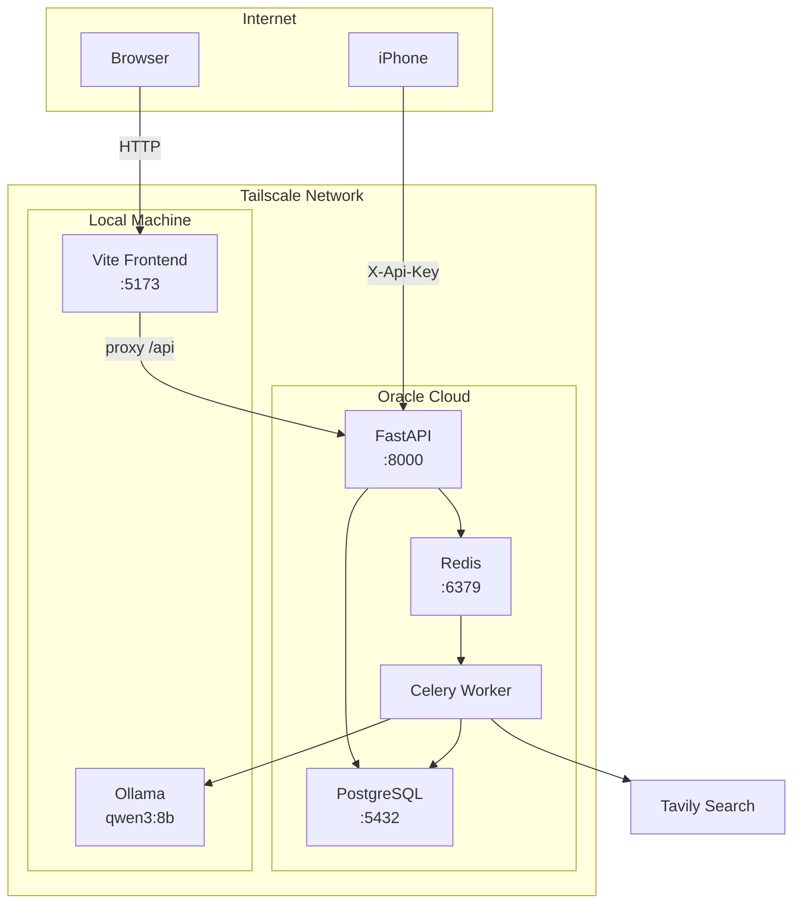

# Budget-Y

Personal finance tracker. Import bank CSVs, auto-categorise transactions with a local LLM, and view spending breakdowns on a dashboard. Self-hosted, no bank APIs.

## What it does

- Import transactions via CSV upload or log them manually via iOS Shortcut
- Auto-categorises merchants using fuzzy matching against past transactions, then falls back to web search + local LLM (Qwen3 via Ollama) for unknowns
- Dashboard with monthly spend by category, budget vs actual, savings trend
- Edit and bulk-change categories, filter and search transactions

## How categorisation works

1. **Fuzzy match** — normalises the merchant name and checks against existing categorised transactions (SequenceMatcher, threshold 0.8). Fast, no LLM needed.
2. **Batch LLM fallback** — unmatched merchants are batched (10 at a time), each gets a Tavily web search for context, then sent to `qwen3:8b` via Ollama. Returns a JSON map of categories.
3. Transactions are saved immediately as `"Other"` so nothing is lost if the LLM is slow or fails. Category is updated once the worker responds.

## Stack

| Layer | Tech |
|---|---|
| Backend | FastAPI, PostgreSQL, SQLAlchemy, Celery + Redis |
| Frontend | React, Vite, Tailwind, Recharts |
| LLM | Ollama (`qwen3:8b`) |
| Search | Tavily API |
| Infra | Docker Compose, Nginx, oauth2-proxy |

## Architecture

Services run on separate machines connected via Tailscale — all URLs configured via env vars.



## Deployment

### All-in-one (local dev)

```bash
cp .env.example .env        # fill in TAVILY_API_KEY
docker compose up -d
docker compose exec backend alembic upgrade head
```

Pull the model on first run:
```bash
docker compose exec ollama ollama pull qwen3:8b
```

### Distributed (separate machines)

Each service has its own compose file in `docker/`:

| File | Runs | Machine |
|---|---|---|
| `docker-compose.db.yml` | PostgreSQL | DB host |
| `docker-compose.backend.yml` | FastAPI + Celery + Redis | Backend host |
| `docker-compose.ollama.yml` | Ollama | GPU host |
| `docker-compose.frontend.yml` | Vite frontend | Frontend host |

Configure each machine's `.env` with the addresses of the other services:

```bash
# Backend host .env
DATABASE_URL=postgresql://budgety:pass@<db-host>:5432/budgety
REDIS_URL=redis://redis:6379/0
OLLAMA_URL=http://<ollama-host>:11434/api/generate

# Frontend host .env
VITE_BACKEND_URL=http://<backend-host>:8000
```

### Migrate from SQLite

```bash
docker compose exec backend alembic upgrade head
docker compose exec backend python scripts/sqlite_to_postgres.py
```

## iOS Shortcut

<table>
<tr>
<td width="50%"></td>
<td width="50%"></td>
</tr>
</table>

POST to `https://<your-domain>/api/shortcut/transactions` with header `X-Api-Key: <key>`:

```json
{ "merchant": "Coles", "amount": 42.50, "card": "ANZ" }
```

## CSV format

Auto-detects two formats:

| Format | Header | Columns |
|---|---|---|
| ANZ | None | `Date, Amount, Description` |
| AMEX | Required | `Date, Description, Amount` |
