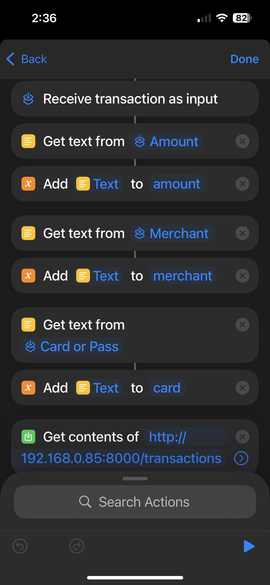
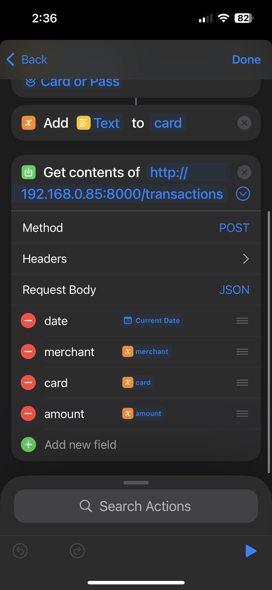

# Budgety

Personal finance tracker with iOS Shortcuts integration. Log transactions from any bank card using a single shortcut, no bank APIs required.

## Features

- Unified transaction logging across all banks and cards
- CSV import/export for bulk operations
- Self-hosted and private
- RESTful API with interactive docs

## Installation

```bash
# Clone and install
git clone https://github.com/yourusername/budgety.git
cd budgety
pip install -r requirements.txt

# Initialize database
alembic upgrade head

# Start server
uvicorn main:app --reload --host 0.0.0.0 --port 8000
```

API available at `http://localhost:8000` (docs at `/docs`)

## iOS Shortcuts Setup

1. Open **Shortcuts** app on your iPhone
2. Tap **+** to create a new shortcut
3. Follow the visual guide below to build your workflow:

<table>
<tr>
<td width="50%">

<p align="center"><em>Step-by-step workflow</em></p>
</td>
<td width="50%">

<p align="center"><em>HTTP request configuration</em></p>
</td>
</tr>
</table>

JSON body format:
```json
{
  "merchant": "Starbucks",
  "amount": 5.50,
  "card": "Visa"
}
```

## Usage

**Quick log:** "Coffee at Starbucks, $5.50, Visa" → Invoke shortcut → Done

**CSV import:**
```bash
curl -X POST "http://localhost:8000/upload-csv" -F "file=@statement.csv"
```

CSV format: `date,merchant,category,amount,card`

## API Endpoints

| Method | Endpoint | Description |
|--------|----------|-------------|
| GET | `/` | Health check |
| POST | `/transactions` | Add transaction |
| GET | `/transactions` | List transactions |
| DELETE | `/transactions` | Delete all |
| POST | `/upload-csv` | Bulk import |

Full docs: `http://localhost:8000/docs`

## Tech Stack

- FastAPI (Python)
- SQLite + SQLAlchemy
- Alembic migrations
- iOS Shortcuts

## License

MIT
