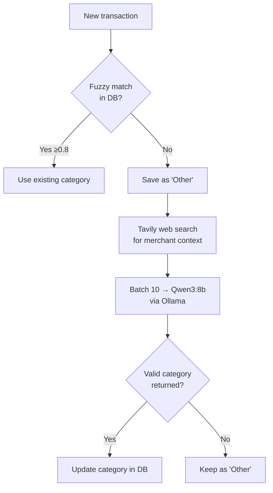
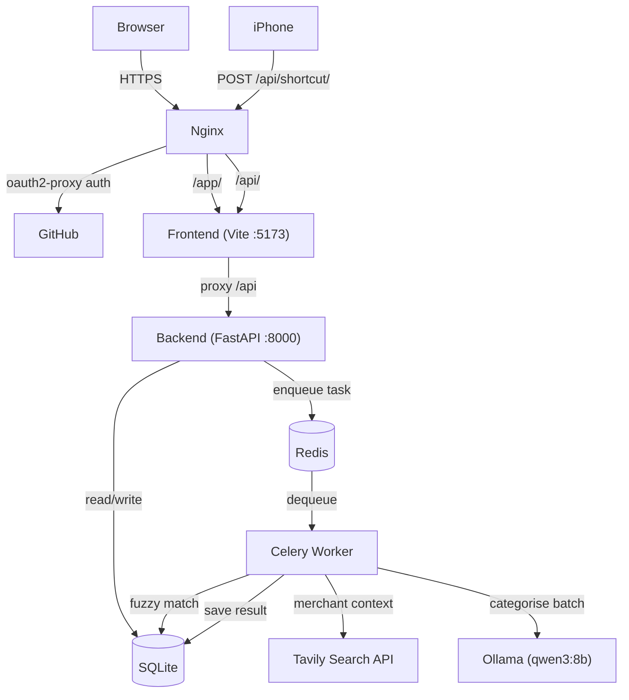

# Budget-Y

Personal finance tracker. Import bank CSVs, auto-categorise transactions with a local LLM, and view spending breakdowns on a dashboard. Self-hosted, no bank APIs.

Frontend was built with Claude Code (Anthropic).

## What it does

- Import transactions via CSV upload or log them manually via iOS Shortcut
- Auto-categorises merchants using fuzzy matching against past transactions, then falls back to a web search + local LLM (Qwen3 via Ollama) for unknowns
- Dashboard with monthly spend by category, budget vs actual, savings trend
- Edit/bulk-change categories, filter and search transactions

## How categorisation works



## Architecture



## Stack

- **Backend** — FastAPI, SQLite, SQLAlchemy, Celery + Redis
- **Frontend** — React, Vite, Tailwind, Recharts
- **LLM** — Ollama (`qwen3:8b`)
- **Search** — Tavily API
- **Infra** — Docker Compose, Nginx, oauth2-proxy (GitHub OAuth)

## Deployment

Everything runs in Docker Compose. Nginx sits in front and proxies to the Vite dev server, with GitHub OAuth via oauth2-proxy protecting all routes.

```bash
cp .env.example .env        # fill in TAVILY_API_KEY, GitHub OAuth creds
docker compose up -d
```

Services:
| Service | Port | Notes |
|---|---|---|
| Frontend (Vite) | 5173 | proxied via Nginx at `/app/` |
| Backend (FastAPI) | 8000 | API at `/api/` |
| Ollama | 11434 | needs `qwen3:8b` pulled |
| Redis | 6379 | Celery broker |

Nginx listens on port 80. All routes require GitHub OAuth except `/api/shortcut/` which uses an API key header for iOS Shortcuts.

```bash
# Pull the model before first run
docker exec budget-y-ollama-1 ollama pull qwen3:8b
```

## iOS Shortcut

POST to `https://<your-domain>/api/shortcut/transactions` with header `X-Api-Key: <key>`:

```json
{ "merchant": "Coles", "amount": 42.50, "card": "ANZ" }
```

## CSV format

Export works out of the box — columns: `Date`, `Description`, `Amount`, optional `Card`.
